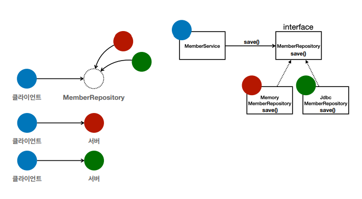

#스프링 핵심 원리 - 기본편

## 스프링 생태계

###스프링의 진짜 핵심

- 스프링은 자바 언어 기반의 프레임워크
- 자바 언어의 가장 큰 특징 - **객체 지향 언어**
- 스프링은 **좋은 객체 지향** 애플리케이션을 개발할 수 
  있게 도와주는 프레임워크

### 좋은 객체 지향 프로그래밍이란?

객체 지향 프로그래밍은 컴퓨터 프로그램을 명령어의 목록으로 
보는 시각에서 벗어나 여러 개의 독립된 단위, 즉 "**객체**"
들의 **모임**으로 파악하고자 하는 것이다. 각각의 객체는 
메시지를 주고 받고, 데이터를 처리할 수 있다. (**협력**)

객체 지향 프로그래밍은 프로그램을 **유연**하고 **변경**이 
용이하게 만들기 때문에 대규모 소프트웨어 개발에 많이 사용된다.
- 레고 블럭 조립하듯이
- 컴퓨터 부품 갈아 끼우듯이
- 컴포넌트를 쉽고 유연하게 변경하면서 개발할 수 있는 방법 

**역할**과 **구현**으로 구분하면 세상이 **단순**해지고, 
**유연**해지며 **변경**도 편리해진다.
- **클라이언트**는 대상의 역할(인터페이스)만 알면 된다.
- **클라이언트** 구현 대상의 **내부 구조를 몰라도** 된다. 
- **클라이언트** 구현 대상의 **내부 구조가 변경**되어도 영향을 받지 않는다.
- **클라이언트** 구현 **대상 자체를 변경**해도 영향을 받지 않는다.

자바 언어의 다형성을 활용
- 역할 = 인터페이스
- 구현 = 인터페이스를 구현한 클래스, 구현 객체 
객체를 설계할 때 **역할**과 **구현**을 명확히 분리

**객체 설계시 역할(인터페이스)을 먼저 부여하고, 그 역할을 수행
하는 구현 객체 만들기**

###다형성의 본질

**클라이언트를 변경하지 않고, 서버의 구현 기능을 유연하게 변경할 수 있다.**
