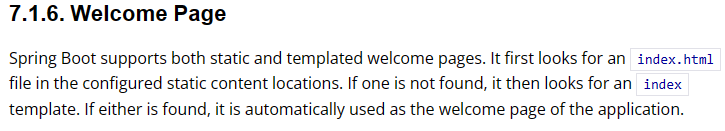
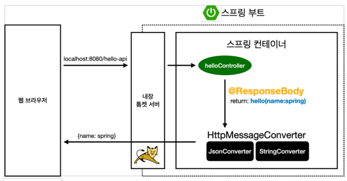

# 스프링 입문-코드로 배우는 스프링 부트, 웹 MVC, DB 접근 기술

- 스프링 부트가 제공하는 Welcome Page 기능
  - static/index.html 을 올려두면 Welcome page 기능을 제공한다.
   
- Thymeleaf 템플릿 엔진을 통해 페이지의 구성을 바꿀 수 있다.
  - html 태그에 속성을 추가해 페이지에 동적으로 값을 추가하거나 처리

- @ResponseBody 사용 원리
  - @ResponseBody 를 사용하고, 객체를 반환하면 객체가 JSON으로 변환됨
  - HTTP의 BODY에 문자 내용을 직접 반환
    - viewResolver 대신에 HttpMessageConverter 가 동작
    - 기본 문자처리: StringHttpMessageConverter
    - 기본 객체처리: MappingJackson2HttpMessageConverter
    - byte 처리 등등 기타 여러 HttpMessageConverter가 기본으로 등록되어 있음

    

### 회원 관리 예제 - 백엔드 개발
  - [IntelliJ] Generate 단축키 (windows) : Alt + Insert
  - Optional: 함수에서 Null을 그대로 반환하는것을 방지하기 위한 'Wrapper' 클래스. 자바 8에서 추가됨. 

### Error 목록
- [ WARN 4872 --- [           main] ion$DefaultTemplateResolverConfiguration : Cannot find template location:](https://www.inflearn.com/questions/264496/%EC%8A%A4%ED%94%84%EB%A7%81%EB%B6%80%ED%8A%B8-%EB%B9%8C%EB%93%9C-%EC%A4%91-%EC%98%A4%EB%A5%98-%EC%A7%88%EB%AC%B8%EB%93%9C%EB%A6%BD%EB%8B%88%EB%8B%A4-%E3%85%A0%E3%85%A0)