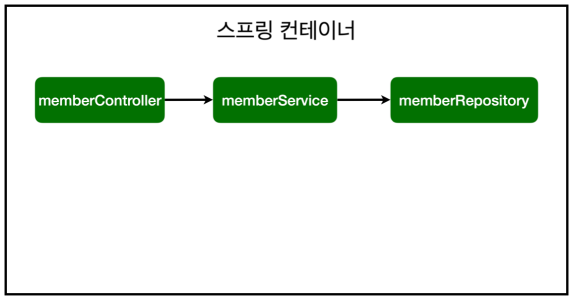
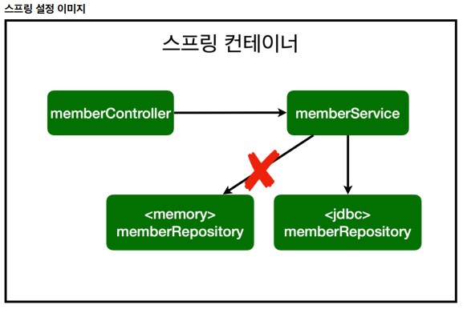

# 스프링 입문-코드로 배우는 스프링 부트, 웹 MVC, DB 접근 기술

- 스프링 부트가 제공하는 Welcome Page 기능
  - static/index.html 을 올려두면 Welcome page 기능을 제공한다.
   
- Thymeleaf 템플릿 엔진을 통해 페이지의 구성을 바꿀 수 있다.
  - html 태그에 속성을 추가해 페이지에 동적으로 값을 추가하거나 처리

- @ResponseBody 사용 원리
  - @ResponseBody 를 사용하고, 객체를 반환하면 객체가 JSON으로 변환됨
  - HTTP의 BODY에 문자 내용을 직접 반환
    - viewResolver 대신에 HttpMessageConverter 가 동작
    - 기본 문자처리: StringHttpMessageConverter
    - 기본 객체처리: MappingJackson2HttpMessageConverter
    - byte 처리 등등 기타 여러 HttpMessageConverter가 기본으로 등록되어 있음

    

### 회원 관리 예제 - 백엔드 개발
  - [IntelliJ] Generate 단축키 (windows) : *Alt + Insert*
  - Optional: 함수에서 Null을 그대로 반환하는것을 방지하기 위한 'Wrapper' 클래스. 자바 8에서 추가됨.
  - [IntelliJ] Rename 단축키 (windows) : *Shift + F6*
  - JUnit을 통한 테스트 코드 작성 시 하나의 파일에서 함수들의 호출 순서는 보장되지 않는다.
    - 따라서 각 테스트들을 의존적으로 만들어션 안된다.
    - 또는 **@AfterEach** 를 통해 각 테스트 진행 시 clear 해주는 함수를 생성한다.
  - [IntelliJ] Extract Method 단축키 (windows) : *Ctrl + Alt + m*
  - [IntelliJ] Test Method 단축키 (windows) : *Ctrl + Shift + t*
  - @BeforeEach: 각 테스트 실행 전에 호출된다. 테스트가 서로 영향이 없도록 항상 새로운 객체를 생성하고,
    의존관계도 새로 맺어준다.

### 스프링 빈과 의존관계
스프링 빈을 등록하는 2가지 방법

**1. 컴포넌트 스캔과 자동 의존관계 설정**
  - @Controller가 있으면 스프링 컨테이너에 해당 객체를 생성해 넣어놓고 관리하게 된다.
  - @Autowired가 있으면 컨테이너에 있는 객체와 매개변수를 연결시켜준다.
    - 연결을 위해 @Service, @Repository 등의 annotation이 필요하다.
    -> **Dependency Injection (의존성 주입)**
  - @Component 애노테이션이 있으면 스프링 빈으로 자동 등록된다.
  - @Controller 컨트롤러가 스프링 빈으로 자동 등록된 이유도 컴포넌트 스캔 때문이다.
  - @Component 를 포함하는 다음 애노테이션도 스프링 빈으로 자동 등록된다.
    - @Controller
    - @Service
    - @Repository
    

**2. 자바 코드로 직접 스프링 빈 등록하기**
  - SpringConfig 파일을 생성해 직접 MemberService와 MemberRepository Bean을 생성한다.

1번과 2번 어떤 방법을 쓰든 결과는 다음과 같다.
    

### 스프링 DB 접근 기술
  - 개방-폐쇄 원칙(OCP, Open-Closed Principle)
    - 확장에는 열려있고, 수정, 변경에는 닫혀있다.
  - 스프링의 DI (Dependencies Injection)을 사용하면 기존 코드를 전혀 손대지 않고, 설정만으로 구현  클래스를 변경할 수 있다
    
  - @SpringBootTest: 스프링 컨테이너와 테스트를 함께 실행한다.
  - @Transactional: 테스트 케이스에 이 애노테이션이 있으면, 테스트 시작 전에 트랜잭션을 시작하고,
    테스트 완료 후에 항상 롤백한다. 이렇게 하면 DB에 데이터가 남지 않으므로 다음 테스트에 영향을 주지
    않는다.

  

### Error 목록
- [ WARN 4872 --- [           main] ion$DefaultTemplateResolverConfiguration : Cannot find template location:](https://www.inflearn.com/questions/264496/%EC%8A%A4%ED%94%84%EB%A7%81%EB%B6%80%ED%8A%B8-%EB%B9%8C%EB%93%9C-%EC%A4%91-%EC%98%A4%EB%A5%98-%EC%A7%88%EB%AC%B8%EB%93%9C%EB%A6%BD%EB%8B%88%EB%8B%A4-%E3%85%A0%E3%85%A0)